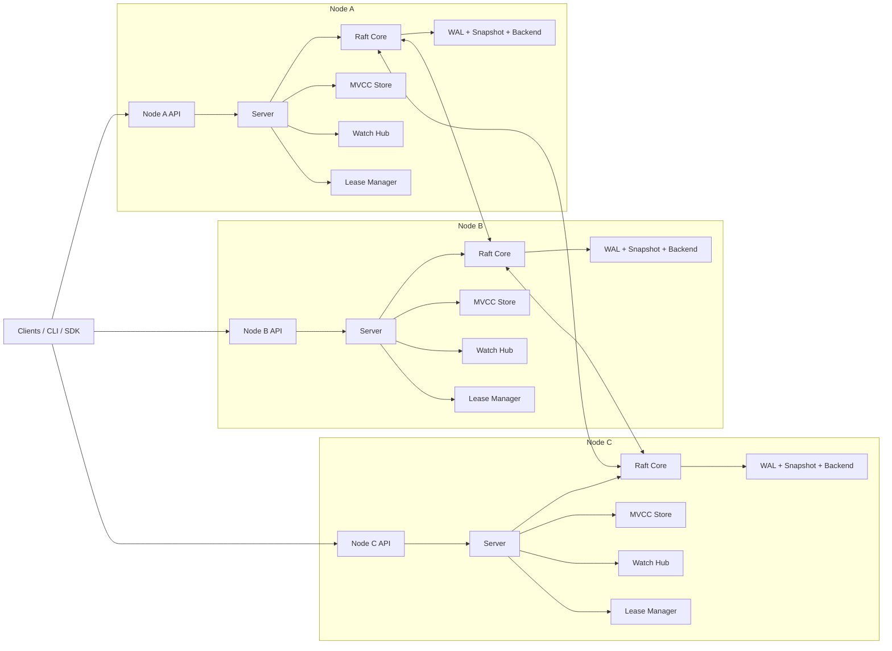
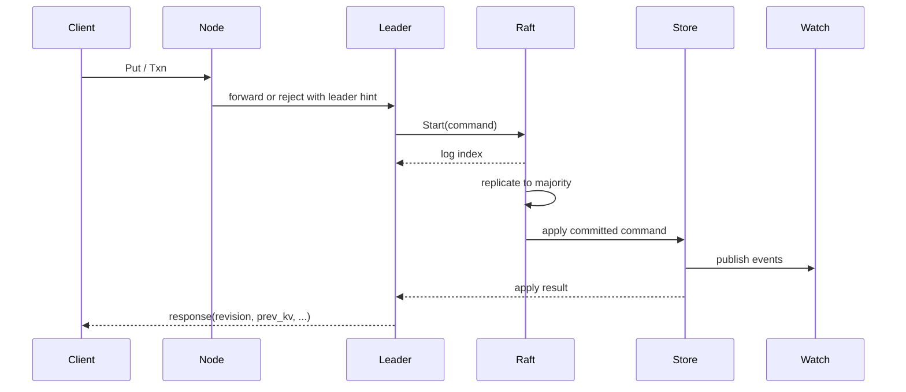

# etcd-lite Architecture and Design

## 1. 项目定位

`etcd-lite` 的目标不是复刻完整 etcd，也不是把 6.824 的 `kvraft` 直接包装成一个服务，而是做一个**可演示、可扩展、可放到简历上的强一致协调存储系统**。

它的定位可以明确为：

- 一个受 etcd v3 启发的单 Raft 组元数据存储集群
- 提供线性一致的 KV、Range、Txn、Watch、Lease 能力
- 复用 6.824 lab 中已经验证过的 Raft 核心实现
- 用真实网络、真实持久化、真实服务接口替换 lab scaffolding
- 在工程结构、可观测性、恢复流程、测试体系上明显高于课程作业实现

一句话定义：

> `etcd-lite` 是一个基于 Raft 的强一致协调服务，适合作为服务发现、配置管理、分布式锁和元数据管理的基础组件。

---

## 2. 设计目标

### 2.1 功能目标

MVP 需要支持以下语义：

- `Put(key, value)`
- `Range(key, end, limit, revision, serializable)`
- `DeleteRange(key, end)`
- `Txn(compare, success, failure)`
- `Watch(key, end, start_revision, prev_kv)`
- `LeaseGrant(ttl)`
- `LeaseKeepAlive(lease_id)`
- `LeaseRevoke(lease_id)`
- `Compact(revision)`

### 2.2 一致性目标

- 写请求线性一致
- 默认读请求线性一致
- 支持可选的本地 `serializable` 读
- `Txn` 以**单个逻辑 revision** 原子提交
- `Watch` 按 revision 全局有序推送事件
- `Lease` 过期删除必须由 leader 驱动并写入 Raft 日志，不能由 follower 本地超时删除

### 2.3 工程目标

- 脱离 `labrpc`，改为真实 RPC 传输
- 脱离内存 `Persister`，改为 WAL + snapshot + backend DB
- 支持 crash recovery
- 支持 log compaction 和状态机 compaction
- 有基本可观测性：日志、metrics、状态查询
- 有清晰的模块边界，避免业务逻辑直接耦合到 Raft 内部

---

## 3. 非目标

为了控制范围，下面这些能力不进入 MVP：

- 多 Raft 组 / 分片 / multi-raft
- 兼容 etcd 全部 API 和 wire protocol
- 生产级 TLS、RBAC、审计
- 跨机房部署优化
- 完整 runtime membership reconfiguration
- 海量 watch 优化、冷热分层存储、碎片整理等高级运维特性

这几个边界很重要。项目的最佳形态是“比 lab 工业化很多”，而不是“一上来尝试重做 etcd 全部复杂度”。

---

## 4. 总体架构

系统采用**单个复制组**，每个节点都同时包含：

- 对外 gRPC API
- Raft 节点
- 本地持久化层
- 本地 MVCC 状态机
- Watch 管理器
- Lease 管理器
- 指标与管理接口

高层结构如下：



### 4.1 关键原则

- **Raft 只负责复制和提交顺序**，不直接知道 KV / Lease / Watch 语义
- **状态机负责数据语义**，包括 revision、MVCC、Txn、Lease 绑定和事件生成
- **API 层不直接改状态**，所有线性一致写都必须走 Raft
- **Watch 是 revision log 的消费视图**，不是“订阅某个 key 的当前值”

---

## 5. 模块拆分

建议的仓库结构：

```text
cmd/
  etcdlited/
  etcdctl-lite/

api/
  proto/
  pb/

server/
  server.go
  config.go
  forwarder.go

raft/
  core/
  transport/
  storage/

backend/
  bolt/

mvcc/
  store.go
  index.go
  txn.go
  compact.go

lease/
  lessor.go
  heap.go

watch/
  hub.go
  matcher.go

wal/
snapshot/

client/
concurrency/
metrics/
tests/
  integration/
  fault/
```

### 5.1 `server`

负责：

- 启动各模块
- 暴露 gRPC API
- 判断本节点是否 leader
- 将写请求转成内部 command 并提交给 Raft
- 对 follower 请求做转发或返回 leader hint
- 维护 apply waiter、请求超时、错误映射

### 5.2 `raft`

负责：

- 选举、日志复制、提交推进、快照安装
- 对上层暴露 `Start()`、`ReadIndex()`、`Status()`、`Snapshot()` 等接口
- 与 transport / storage 解耦

### 5.3 `backend`

负责：

- 底层 KV 持久化
- 有序 key 扫描
- 事务性写入
- 存储元数据、当前值、历史 revision、lease 信息

### 5.4 `mvcc`

负责：

- 全局 revision 分配
- 当前值与历史版本维护
- Range / Put / Delete / Txn 语义
- 生成 watch event
- Compaction

### 5.5 `lease`

负责：

- lease 元信息维护
- key 与 lease 的双向绑定
- leader 本地 TTL 调度
- 到期后生成 revoke / delete Raft command

### 5.6 `watch`

负责：

- watcher 注册与取消
- 从指定 revision 回放事件
- 对在线 watcher 推送新事件
- 对 compacted revision 返回错误

---

## 6. 核心数据模型

### 6.1 全局 revision

整个存储系统维护一个单调递增的全局 revision：

- 每次写事务提交时，`main_revision += 1`
- 一个 `Txn` 内如果修改了多个 key，它们共享同一个 `main_revision`
- 同一事务内多个子操作可以用 `sub_revision` 区分顺序

这比 lab 中的“每条命令一个日志项，一个 map 直接改值”更接近真实系统。

### 6.2 KeyValue 元数据

每个当前 key 维护：

- `key`
- `value`
- `create_revision`
- `mod_revision`
- `version`
- `lease_id`
- `is_tombstone`（历史版本或删除事件中使用）

语义如下：

- `create_revision`: key 第一次创建时的 revision
- `mod_revision`: 当前版本最后一次修改时的 revision
- `version`: 当前世代内被更新过多少次
- `lease_id`: 当前 key 绑定的 lease，`0` 表示无 lease

### 6.3 MVCC 存储视图

建议将存储分成四类逻辑数据：

1. `meta`
2. `current_kv`
3. `history`
4. `lease`

可以映射到 bbolt 的 bucket：

```text
meta/
  cluster_id
  member_id
  applied_index
  applied_term
  current_main_rev
  compact_main_rev

current_kv/
  <key> -> latest KeyValue

history/
  <main_rev, sub_rev> -> Event

lease/
  <lease_id> -> LeaseRecord

lease_keys/
  <lease_id, key> -> empty
```

### 6.4 为什么要同时存 `current_kv` 和 `history`

- `current_kv` 用于高效读取和范围扫描
- `history` 用于 watch 回放、历史 revision 读取、compaction 判定

这是一种很实用的折中。你不需要完全照搬 etcd 的内部索引结构，但必须显式区分“当前状态”和“历史事件”。

---

## 7. 状态机命令模型

Raft 日志里不直接塞 RPC request，而是定义明确的内部 command：

```go
type Command struct {
    ID        RequestID
    Kind      CommandKind
    Put       *PutCommand
    Delete    *DeleteRangeCommand
    Txn       *TxnCommand
    LeaseGrant     *LeaseGrantCommand
    LeaseKeepAlive *LeaseKeepAliveCommand
    LeaseRevoke    *LeaseRevokeCommand
    Compact        *CompactCommand
}
```

每个 command 在 apply 时返回结构化结果：

```go
type ApplyResult struct {
    Revision    int64
    Succeeded   bool
    Responses   []OpResponse
    Events      []Event
    Err         error
}
```

这样做有几个好处：

- API 层和状态机解耦
- 便于做幂等处理和错误分类
- 便于测试状态机逻辑
- 未来新增命令类型时不会污染 Raft 核心

---

## 8. 请求处理流程

### 8.1 写请求：`Put/Delete/Txn`



关键点：

- 只有 leader 接受线性一致写
- 客户端可以连任意节点，但 follower 最好做透明转发
- 响应必须在 **command apply 完成后** 返回，而不是在日志追加成功后立即返回

### 8.2 线性一致读：`Range(linearizable=true)`

推荐实现为 `ReadIndex` 路径：

1. leader 收到读请求
2. leader 向多数派确认自己仍是 leader，拿到 `readIndex`
3. leader 等待本地 `appliedIndex >= readIndex`
4. 直接从本地 MVCC backend 读取并返回

这样比“所有读都写入日志”更工业化，也比“leader 本地直接读”更正确。

### 8.3 本地可串行化读：`Range(serializable=true)`

这类读不经过 `ReadIndex`，直接从本地 backend 返回：

- 延迟低
- 允许读到旧数据
- 适合作为可选优化路径

MVP 可以先只开放 leader 上的 linearizable read，之后再补 serializable read。

### 8.4 Watch

watch 的处理分两段：

1. **追历史**：从 `start_revision + 1` 开始扫描 `history`
2. **追实时**：把 watcher 注册到 `WatchHub`，接收后续 event

如果请求的起点 revision 已经被 compact：

- 返回 `ErrCompacted`
- 客户端需要用更新后的 revision 重新建立 watch

---

## 9. Txn 语义设计

`Txn` 是整个项目里最值得写好的部分之一，因为它能明显体现系统设计水平。

### 9.1 Compare 条件

支持：

- `version(key) == / != / > / <`
- `create_revision(key) ...`
- `mod_revision(key) ...`
- `value(key) ...`
- `lease(key) ...`

### 9.2 执行模型

一个 `Txn` 包含：

- `compare[]`
- `success_ops[]`
- `failure_ops[]`

执行流程：

1. command 进入 Raft 日志
2. 在 apply 阶段读取当前状态
3. 评估全部 compare
4. 选择 success 或 failure 分支
5. 整个分支内的写操作共享同一个 `main_revision`
6. 一次性提交并生成事件

### 9.3 为什么 compare 必须在 apply 阶段执行

因为只有 apply 阶段才拥有全局线性顺序。如果在 leader 收到请求时就先本地判断 compare，再把结果写入日志，会在并发写入下产生错误语义。

---

## 10. Lease 设计

Lease 不是“给 key 加一个本地过期时间”，而是一个被复制系统共同认可的租约对象。

### 10.1 Lease 元数据

每个 lease 维护：

- `lease_id`
- `ttl_seconds`
- `expire_at`
- `attached_keys[]`

### 10.2 关键语义

- `Grant` 走 Raft，创建 lease
- `Attach` 作为 `Put/Txn` 的一部分写入状态机
- `KeepAlive` 走 Raft，刷新过期时间
- `Revoke` 走 Raft，删除 lease 并删除所有绑定 key
- 到期删除由 leader 检测后，生成 `LeaseRevoke` command 进入日志

### 10.3 为什么 KeepAlive 也建议走 Raft

对这个项目来说，这是一个非常务实的取舍：

- 实现简单，语义清楚
- 故障恢复时不会出现 leader 本地 TTL 状态与复制状态不一致
- 面试时可以清楚解释“一切影响状态的动作都经过共识”

缺点是 keepalive 写放大更高，但对简历项目完全可接受。

### 10.4 过期调度

leader 本地维护一个最小堆：

- 堆元素按 `expire_at` 排序
- 后台 goroutine 周期性检查最近到期 lease
- 如果 lease 已过期，则提交 `LeaseRevoke` command

注意：

- follower 不做本地删除
- 即使 follower 本地时钟先走，也不能主动删 key

---

## 11. Watch 设计

### 11.1 事件模型

每次修改产生 `Event`：

- `type`: `PUT` / `DELETE`
- `kv`
- `prev_kv`（可选）
- `revision`

### 11.2 Watch 注册结构

每个 watcher 包含：

- `watch_id`
- `key`
- `range_end`
- `start_revision`
- `filters`
- `prev_kv`
- `stream`

### 11.3 分发策略

状态机 apply 完成后：

1. 产生 `events[]`
2. 将事件按 revision 推给 `WatchHub`
3. `WatchHub` 找到匹配 watcher 并异步投递

### 11.4 背压处理

必须尽早考虑这个问题，否则 watch 很容易把系统拖死。

建议：

- 每个 watcher 有有界 channel
- 写满后按策略处理：断开慢 watcher，或者返回 `ErrWatcherSlow`
- 不允许单个慢客户端阻塞 apply 主路径

---

## 12. Compaction 与 Snapshot

这是从 lab 走向“像一个真实系统”的关键升级点。

### 12.1 两类压缩

系统里实际上有两种不同的压缩：

1. **Raft log compaction**
2. **MVCC history compaction**

两者相关，但不是一回事。

### 12.2 Raft log compaction

当 `appliedIndex` 足够靠前时：

- 生成状态机 snapshot
- 调用 Raft `Snapshot(lastIncludedIndex, snapshotData)`
- 截断旧日志

snapshot 内容至少包含：

- `last_included_index`
- `last_included_term`
- `applied_revision`
- backend checkpoint 或逻辑导出数据

### 12.3 MVCC history compaction

`Compact(revision)` 的语义是：

- revision 之前的历史事件可以被清理
- 当前值必须保留
- 从更老 revision 建立 watch 的请求要返回 `ErrCompacted`

建议把 compaction 也做成 Raft command，这样所有节点都以同样顺序推进 `compact_revision`。

### 12.4 推荐关系

- `Compact(revision)` 负责推进历史可见边界
- 后台任务负责清理 `history` 中小于等于该 revision 的旧数据
- Raft snapshot 负责缩短恢复时间和降低日志体积

---

## 13. 持久化设计

建议采用：

- `WAL`：存 Raft 日志和硬状态
- `backend.db`：存状态机持久化数据
- `snapshot/`：存 snapshot 文件
- `manifest`：存当前数据目录元信息

目录结构示例：

```text
data/
  member/
    wal/
      0000000000000000.wal
      0000000000000001.wal
    snap/
      00000000000003e8.snap
    backend/
      backend.db
    manifest.json
```

### 13.1 WAL 记录内容

WAL 至少需要支持：

- `HardState(term, vote, commit)`
- `Entry(index, term, type, data)`
- `SnapshotMarker`

### 13.2 backend 事务边界

一个 apply 批次内建议使用一次 backend 事务完成：

- revision 递增
- current kv 更新
- history 事件写入
- lease 绑定更新
- applied index 更新

这样恢复后不会出现“Raft 已提交，但状态机只写了一半”的中间状态。

### 13.3 恢复流程

节点启动时：

1. 读取 `manifest`
2. 加载最新 snapshot
3. 恢复 backend.db
4. 恢复 WAL 中 snapshot 之后的 Raft 日志
5. 重建内存索引
6. 恢复 lease heap
7. 启动 Raft 和 API 服务

### 13.4 重建哪些内存结构

以下结构不要求直接持久化，但要能从 backend 恢复：

- watcher registry
- lease 最小堆
- key range matcher
- apply waiter

---

## 14. 对 6.824 Raft 的复用与改造

这是项目成败的核心：**尽量复用 Raft 共识核心，但不要复用 lab 周边脚手架。**

### 14.1 可以直接复用的部分

- leader election
- term / vote 管理
- 日志匹配与冲突回退
- `nextIndex` / `matchIndex`
- 提交推进逻辑
- per-follower replicator goroutine
- snapshot install 的核心语义

### 14.2 必须重构的部分

#### 传输层

把 `labrpc` 替换为接口化 transport：

```go
type Transport interface {
    SendRequestVote(ctx context.Context, to uint64, req *RequestVoteRequest) (*RequestVoteResponse, error)
    SendAppendEntries(ctx context.Context, to uint64, req *AppendEntriesRequest) (*AppendEntriesResponse, error)
    SendInstallSnapshot(ctx context.Context, to uint64, req *InstallSnapshotRequest) (*InstallSnapshotResponse, error)
}
```

#### 存储层

把 `Persister` 替换成真实存储接口：

```go
type Storage interface {
    InitialState() (HardState, SnapshotMeta, error)
    Entries(lo, hi uint64) ([]Entry, error)
    Term(index uint64) (uint64, error)
    LastIndex() uint64
    FirstIndex() uint64
    Append(entries []Entry) error
    SetHardState(st HardState) error
    CreateSnapshot(meta SnapshotMeta, data []byte) error
    ApplySnapshot(meta SnapshotMeta, data []byte) error
    Compact(index uint64) error
}
```

#### 读路径

lab 的 `kvraft` 基本可以把所有操作都当作写命令排队处理，但在这里应新增：

- `ReadIndex(ctx)` 或等价线性一致读屏障
- `Status()` 用于返回 leader / term / applied index

#### apply 通知

从单一 `ApplyMsg` 扩展为更明确的 apply result / error 通道，便于服务层等待结果并处理超时。

### 14.3 建议不要大改的部分

如果你的目标是“尽可能复用 lab Raft”，那就不要一开始把它完全改成 etcd/raft 的 `Ready` 风格。更稳妥的方案是：

- 保留现有 goroutine 架构
- 保留 `Start(command)` 提交接口
- 保留 `applyCh` 驱动状态机的主流程
- 在此基础上引入 transport/storage 抽象

这能最大化复用已有正确性。

### 14.4 需要新增的 Raft 能力

- `ReadIndex`
- `Status`
- `TransferLeadership`（可后置）
- `ReportUnreachable` / 链路错误反馈（可选）
- 更清晰的 snapshot metadata

---

## 15. gRPC API 设计

建议按服务拆分，而不是做成一个巨大的 RPC 集合。

### 15.1 KV Service

```proto
service KV {
  rpc Range(RangeRequest) returns (RangeResponse);
  rpc Put(PutRequest) returns (PutResponse);
  rpc DeleteRange(DeleteRangeRequest) returns (DeleteRangeResponse);
  rpc Txn(TxnRequest) returns (TxnResponse);
  rpc Compact(CompactionRequest) returns (CompactionResponse);
}
```

### 15.2 Watch Service

```proto
service Watch {
  rpc Watch(stream WatchRequest) returns (stream WatchResponse);
}
```

### 15.3 Lease Service

```proto
service Lease {
  rpc LeaseGrant(LeaseGrantRequest) returns (LeaseGrantResponse);
  rpc LeaseRevoke(LeaseRevokeRequest) returns (LeaseRevokeResponse);
  rpc LeaseKeepAlive(stream LeaseKeepAliveRequest) returns (stream LeaseKeepAliveResponse);
  rpc LeaseTimeToLive(LeaseTimeToLiveRequest) returns (LeaseTimeToLiveResponse);
}
```

### 15.4 Cluster / Maintenance Service

```proto
service Cluster {
  rpc MemberList(MemberListRequest) returns (MemberListResponse);
}

service Maintenance {
  rpc Status(StatusRequest) returns (StatusResponse);
  rpc Snapshot(SnapshotRequest) returns (stream SnapshotResponse);
}
```

### 15.5 关键消息字段

每个请求最好带上：

- `request_id`
- `client_id`
- `timeout_ms`

这样可以实现：

- 请求链路跟踪
- 基本幂等支持
- 失败重试时的结果去重

---

## 16. 幂等与重试

比起 lab，真实 RPC 系统必须认真处理重试。

建议在服务层引入：

- `client_id`
- `request_id`

服务端维护最近一段时间的已完成请求缓存：

- 如果同一个 `(client_id, request_id)` 再次到来
- 且原请求已提交完成
- 直接返回之前的结果

这和你在 `kvraft` 里做的去重逻辑是一脉相承的，但这里应该做成通用机制，而不是写死在某个 KV handler 里。

---

## 17. 一致性语义总结

### 17.1 写

- `Put/Delete/Txn/LeaseGrant/KeepAlive/Revoke/Compact` 都是线性一致的

### 17.2 读

- 默认 `Range` 线性一致
- `serializable=true` 时允许返回旧数据

### 17.3 Watch

- 事件按 revision 单调递增
- 同一 revision 内事件顺序稳定
- compacted revision 之前的历史不保证可追

### 17.4 Lease

- lease 过期的可见效果通过 Raft 提交后才生效
- 任何节点都不能在本地擅自执行过期删除

---

## 18. 并发原语层

这是一个非常适合放在第二阶段的“亮点模块”。

在 `client/concurrency` 上实现：

- 分布式锁 `Mutex`
- Leader election `Election`

### 18.1 锁

基于：

- lease
- txn compare-and-put

典型方式：

- 创建 `/locks/<name>/<session-id>`
- 通过事务比较是否已有更早持有者
- session 失效时由 lease 自动清理

### 18.2 选举

基于：

- 带 lease 的顺序 key
- watch 前驱 key

这会让你的项目从“一个存储服务”提升为“一个能支撑协调场景的平台”。

---

## 19. 可观测性与运维接口

MVP 至少做这些：

### 19.1 指标

- 当前 term
- leader id
- commit index
- applied index
- last snapshot index
- backend key 数
- watcher 数
- 活跃 lease 数
- apply 延迟
- proposal 失败数

### 19.2 日志

日志分层建议：

- `INFO`: 选举、成员启动、snapshot、compaction
- `WARN`: 请求超时、慢 watcher、转发失败
- `ERROR`: WAL 损坏、backend 事务失败、snapshot 恢复失败

### 19.3 管理接口

- `/metrics`
- `/debug/status`
- `Status` RPC

---

## 20. 测试策略

这个项目要想在简历上站得住，测试必须成体系。

### 20.1 单元测试

- MVCC revision 递增是否正确
- Txn compare 语义
- Range / prefix scan
- lease attach / revoke
- watch matcher
- compaction 语义

### 20.2 Raft 集成测试

- leader 选举
- 日志复制
- follower crash/restart
- snapshot install
- 网络分区恢复

### 20.3 端到端测试

搭 3 节点集群，验证：

- 写入后线性一致读
- 并发 Txn 正确性
- watch 从旧 revision 追平
- lease 到期删除
- compact 后旧 watch 报错
- kill -9 后重启恢复

### 20.4 故障注入

推荐至少做轻量级 fault injection：

- 延迟 / 丢包 / 乱序
- fsync 失败模拟
- snapshot 生成中断
- follower 落后很多后追平

如果时间够，再做一个简单历史检查器去验证线性一致结果，会非常加分。

---

## 21. 分阶段实施路线图

### Phase 0: 代码抽骨架

目标：

- 从 6.824 仓库中提取可复用 `raft/`
- 定义 transport / storage 接口
- 去掉 `labrpc` 和 `Persister` 的强绑定

交付物：

- 可独立运行的 Raft package
- 3 节点基本选举和复制测试

### Phase 1: 最小可用集群

目标：

- gRPC API
- WAL + backend.db
- `Put/Range/Delete`
- leader 转发

交付物：

- 能跑起来的 3 节点 KV 集群
- crash 后可恢复

### Phase 2: 真正的存储语义

目标：

- global revision
- MVCC metadata
- `Txn`
- linearizable read with `ReadIndex`

交付物：

- 不再只是“复制一个 map”
- 具备 etcd-lite 的核心味道

### Phase 3: Watch + Lease

目标：

- event history
- watch stream
- lease grant / keepalive / revoke
- leader-driven expiration

交付物：

- 支持服务发现和协调类场景 demo

### Phase 4: Snapshot + Compaction + Observability

目标：

- snapshot 恢复
- history compaction
- metrics / status

交付物：

- 系统具备长期运行能力

### Phase 5: 并发原语与项目包装

目标：

- lock / election client
- CLI 工具
- benchmark
- demo 文档和架构图

交付物：

- 一套能直接讲给面试官听的完整项目

---

## 22. 推荐的 MVP 范围

如果你想尽快做出一个“强而完整，但不会失控”的版本，我建议 MVP 锁定为：

- 单 Raft 组，3 节点
- gRPC
- WAL + bbolt backend
- `Put/Range/Delete/Txn`
- global revision
- `Watch`
- `LeaseGrant/KeepAlive/Revoke`
- `ReadIndex` 线性一致读
- snapshot + compact
- metrics + status

不要在 MVP 里做：

- 动态扩缩容
- TLS / 认证
- 多租户
- 多 Raft 组
- 完全兼容 etcd 客户端协议

这个范围已经足够强，而且工程叙事很完整。

---

## 23. 和 6.824 Lab 的关系

这个项目最好的叙事不是“我把 lab 改复杂了”，而是：

1. 我基于课程中验证过的 Raft 实现搭建了一个真实可运行的协调存储系统
2. 我把教学环境中的假网络、假持久化替换成了工程化模块
3. 我在状态机层实现了 MVCC、Txn、Watch、Lease 等更接近工业系统的语义
4. 我补上了恢复、压缩、观测和端到端测试能力

这条线是顺的，也最适合写在简历里。

---

## 24. 简历表达建议

这个项目完成后，你的简历描述可以朝这个方向写：

> Built an etcd-inspired strongly consistent coordination store in Go by reusing and refactoring a MIT 6.824 Raft implementation; added gRPC networking, WAL/snapshot persistence, MVCC revisions, transactions, watch streams, lease-based key expiration, and crash recovery across a 3-node cluster.

如果想更强调工程性，可以再补一句：

> Designed linearizable reads with Raft ReadIndex, implemented history compaction and snapshot restore, and built integration tests for partition, restart, and lease-expiration scenarios.

---

## 25. 最终建议

这个项目最重要的三条原则：

1. **复用 Raft 核心，不复用 lab 的脚手架。**
2. **先做单组强一致协调存储，不要过早做分片。**
3. **优先把语义和恢复链路做完整，再做更多功能。**

如果按这份设计推进，`etcd-lite` 会是一个明显强于普通课程项目的系统型作品，而且它和你现有的 6.824 经验衔接非常自然。
